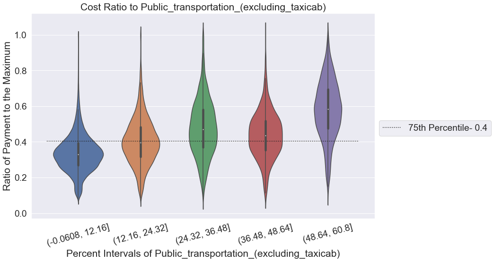
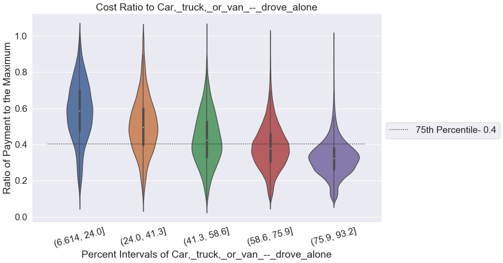

# Module 5 Final Project

## Introduction

As part of Module 5 of Flatiron Data Science Program (Machine Learning), I select a dataset for the Centers for Medicare & Medicaid Services (CMS),  <a href="https://data.cms.gov/Medicare-Inpatient/Inpatient-Prospective-Payment-System-IPPS-Provider/97k6-zzx3">“Inpatient Prospective Payment System (IPPS) Provider Summary for the Top 100 Diagnosis-Related Groups (DRG) - FY2011”.</a> There are 3,*** medical providers  and cost information on top 100 most frequently billed discharges. I combined that information from the <a href="https://data.cms.gov/Medicare-Inpatient/Inpatient-Prospective-Payment-System-IPPS-Provider/97k6-zzx3">American Community Survey (ACS)</a> with county demographic, income, poverty, and commuting information. Using ACS data, I built models to predict  high cost areas, and with these models analyze  the feature importance of individual ACS classes. 

## Objectives

<ul>
	<li>Attempt to Model the Cost Ratio from a Given Provider/Procedure using the below methods
    <ul>
        <li>Cluster</li>
        <li>Decision Tree</li>
        <li>Decision Tree Regressor</li>
        <li>Random Forest</li>
    </ul>
    <li>Using attributes of these models like feature importance to analyze the information gathered from the ACS data.</li>
</ul>

## Exploration of the Data

### Centers for Medicare & Medicaid Services (CMS)

Procedure Labels

**DRG Definition**
    
DRG (diagnosis-related group) definition is a payment categories that are used for the purpose of reimbursing hospitals (especially for Medicare). Each definition represents particular clas for each case in a given category with a fixed fee regardless of the actual costs incurred. An example of a DRG definftion can be a seen below. There is 100 individual defintion in the study.

'057 - DEGENERATIVE NERVOUS SYSTEM DISORDERS W/O MCC'

**ID**

There is designated ID number for each definition (see "057").

**Label**

There are 57 individual procedure names. (see "DEGENERATIVE NERVOUS SYSTEM DISORDERS").

**Complications / Comorbidity Conditions**

In some definitions have pre-existing complication or comordibity information that effect the treat for given procedure. These are options for these information: 
    <ul>
        <li>without_ccmcc</li>
        <li>with_mcc</li>
        <li>with_cc</li>
        <li>with_ccmcc</li>
    </ul>

Provider Information

**Provider Id**

The CMS Certification Number (CCN) assigned to the Medicare certified hospital facility.

**Provider Name**

The name of the provider.

**Provider Street Address**

The provider’s street address.

**Provider City**

The city where the provider is located.

**Provider State**

The state where the provider is located.

**Provider Zip Code**

The provider’s zip code.

**Provider HRR**

The Hospital Referral Region (HRR) where the provider is located
 

Cost Information

**Total Discharges**

The number of discharges billed by the provider for inpatient hospital services.

**Average Covered Charges**

The provider's average charge for services covered by Medicare for all
discharges in the MS-DRG. These will vary from hospital to hospital because of differences in hospital
charge structures.

**Average Total Payments**

The average total payments to all providers for the MS-DRG including the MSDRG amount, teaching, disproportionate share, capital, and outlier payments for all cases. Also included in average total payments are co-payment and deductible amounts that the patient is responsible for and any additional payments by third parties for coordination of benefits.

**Average Medicare Payments**

The average amount that Medicare pays to the provider for Medicare's
share of the MS-DRG. 

**Cost Ratio (Calculated in Pre Processing)**

The ratio of the Average Total Payment divided by the most expensive cost for the for that particular DRG definition

###  American Community Survey (ACS)

American Community Survey is ongoing survey conducted by the US Census Bureau . The survey collect various information about localities all across the US providing a valuable resource for body public and private researcher and planners. For the  model I use data the 2012 survey. Below are categories selected.

<ul>
    <li>Employment Status</li>
    <li>Commuting to Work</li>
    <li>Occupation</li>
    <li>Industry</li>
    <li>Class of Worker</li>
    <li>Income and Benefits</li>
    <li>Health Insurance Coverage</li>
    <li>Poverty</li>
    <li>Sex and Age</li>
    <li>Race</li>
    <li>Poverty</li>
</ul>

## Modeling with Results

Clustering

I attempted to use clustering to find groupings in the  ACS data, CMS data, and combined data. Unfortunate I did not find distinct clusters based on the calinski harabasz score. See results of the clustering for various cluster sizes.

Decision Tree Regressor

I also attempted to use regression with decision trees because I wanted to produce a continuous result. The output did not effectively reflect the data. See results compared to the actual data in the below graph. 

##### Random Forest
 
I decided to bin my target data into three columns: top 25% of cost ratios, and everything else. This binning strategy leads to an imbalanced output with the lower value being significantly more than the extreme bin. This imbalance leads the model to over select for the lower bin. In order remedy this problem, we oversampled the top 25% through random choice with replacement. The final model produced good result with a 80.5% accuracy. 

## Interpreting Feature Importance

Using the feature importance method in scikit learn, I selected the 3 most influential ACS data features in the Random Forest model to explore, and those top features were all commuting to work data.

Percent of People that Used Public Transportation

The below graph display the ratio of the payment to the maximiuim procedure payment versus to the percent of county residents use public transport. As can be see in the graph, the average of the ratio for the binned values increased as the percent of pubilc transport users increased. The averages of the three largest categories are above the 25% threshold.

 Percent of People that Drive Alone 

This graph shows the cost ratio versus the percent of county residents that drive to work alone using a car, tuck , or van. Inverse to the previous graph, the average cost ratio decreased as the binned percents increased. The three smallest bins' averages were above the threshold.

Percent of People that Walk

The below graph display the cost ratio versus to the percent of county residents that walk. The feature produces more mixed results. The average ratio for the binned values move around as the percent of pubilc transport users increased.

